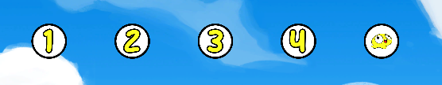

# The Sidebar

The sidebar is the inventory of the map maker, containing everything you need to build awesome maps.
It has platforms of every type! (switch types using the buttons on the left)

## Creating Platforms

<video autoplay loop muted playsinline style="border-radius: 5px;">
  <source src="./gifs/create.mp4" type="video/mp4">
  Your browser does not support the video tag.
</video>

To create a platform, just drag your platform of choice onto the world and voila!

::: info
Alternatively, you can hold `ctrl` and drag a platform to clone it into the world

<video autoplay loop muted playsinline style="border-radius: 10px;">
  <source src="./gifs/clone.mp4" type="video/mp4">
  Your browser does not support the video tag.
</video>
:::

##  Removing Platforms 

Okay lets say you created a platform which you don't want anymore, there are two simple ways to remove it completely:

* Drag it back into the sidebar

* Click it, and press `del`

## Moving Platforms

<video autoplay loop muted playsinline style="border-radius: 5px;">
  <source src="./gifs/drag.mp4" type="video/mp4">
  Your browser does not support the video tag.
</video>

To move your platform, just drag it and plop it wherever you want it to be. That's it!

If you want to you can also just modify the platform's position from the Inspector (more on that later)

::: tip
If you want to move your platform only on the x/y axis, just move it while pressing `shift` and it will clamp to the closest axis!

<video autoplay loop muted playsinline style="border-radius: 10px;">
  <source src="./gifs/move-shift.mp4" type="video/mp4">
  Your browser does not support the video tag.
</video>
:::

 

---

 

# The Marker

Hover over your platform with the mouse, see that box in the middle? that's the marker.

If it's white that means you are in **scaling mode**,
if it's black, you are in **rotating mode**.

::: info switching between them is easy, just press `s` to enter scaling mode and `r` for rotating mode. 
:::

## Scaling Platforms

<video autoplay loop muted playsinline style="border-radius: 5px;">
  <source src="./gifs/scale.mp4" type="video/mp4">
  Your browser does not support the video tag.
</video>

To scale a platform, just hover it and drag the marker to resize.
* **upwards** = increase scale
* **downwards** = decrease scale

::: tip
If you want to scale the platform not arbitrarily, just hold down `shift` while scaling and the scale will increase/decrease by multiples of 0.1

<video autoplay loop muted playsinline style="border-radius: 10px;">
  <source src="./gifs/scale-shift.mp4" type="video/mp4">
  Your browser does not support the video tag.
</video>
:::

## Rotating Platforms

<video autoplay loop muted playsinline style="border-radius: 5px;">
  <source src="./gifs/rotate.mp4" type="video/mp4">
  Your browser does not support the video tag.
</video>

To rotate a platform, just hover it and drag the marker around, the platform will face your cursor as long as the marker is visible.

::: tip
If you want to rotate the platform not arbitrarily, just hold down `shift` while rotating and the rotation will inch by 15 angle multiples while rotating.

<video autoplay loop muted playsinline style="border-radius: 10px;">
  <source src="./gifs/rotate-shift.mp4" type="video/mp4">
  Your browser does not support the video tag.
</video>
:::

 

## Spawn Points

Spawn points are the items that decide where the players will spawn on the map, any map is required to have **only** 4 of them (or 1 spawn all) for it to be able to save.

Spawn points can be accessed by clicking the yellow button on the left of the sidebar, with numbers representing the player they spawn (except for spawn all which contains a bopl)

::: tip
cloning a spawn point will create *the next* spawn point (except for spawn all)

<video autoplay loop muted playsinline style="border-radius: 10px;">
  <source src="./gifs/clone-spawn.mp4" type="video/mp4">
  Your browser does not support the video tag.
</video>
:::

## Spawn All

The spawn-all spawn point is an item that when placed on the map, automatically spawns every player in the spot it is in.

* much easier than dragging 4 spawn points to the same position.
