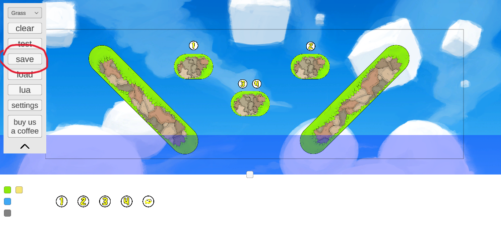
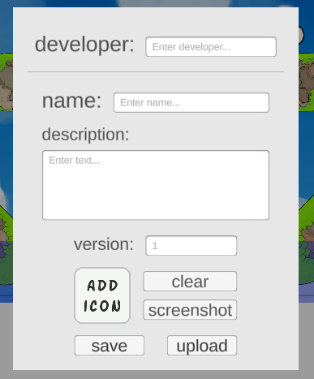
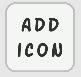

# Umm... What Now??

After you have finished making your amazing map, here's what you can do to save it and share it with anyone you want!

## Lua

Wait! Before you decide to publish / save your map, maybe consider adding a little bit of lua magic to make your map x100 times more fun and dynamic, here are some things you can do with lua:

* making a platform move linearly
* making a platform rotate indefinitely
* speweing arrow rain above the player
* summoning explosions out of thin air
* picking yourself the abilities of the players

and so much more! We thoroughly encourage you to check out the [Lua Docs](../lua/index.md)! :D

## Saving The Map

First, open the menu and enter the [*save dialogue*](#save-dialogue)

([for more info about the menu](/makerguide/ui.md#the-menu))

## Save Dialogue

* Developer - the name of the maker of the map - you! :D
* Name - the actual name of the map (e.g. "Boulder Madness", "SpaceTrashCraziness", "<3")

::: warning
Saving a map with the same name as a pre-existing map will completely overwrite the existing one, this is done to make updating a map very easy while editing it
:::

* Description - write super shortly about the map, or don't. we don't care \[as\].

* Version - this is the constant version of the map, this only changes when resaving the map.

### Map Icon

The map icon is an image that is used as a cover for the map on the website (maybe not now but in the near future)

* The icon has to be a square image (width = height)
* The icon has to be less than **480kb** in size

The icon can be picked either by clicking on the *Add Icon* button, or by pressing the *screenshot* button which will snap a picture of the current view of the map.

## Saving / Uploading

The *upload* button functions exactly like the *save* button except it is also sending the map directly to the map website. 

* This means you will also need to pick a saving directory for the action. 

And that's it!! you just finished and published your very own bopl battle map, good job and happy map making!