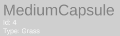
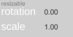
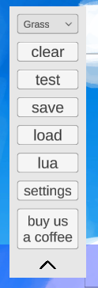

# Map Maker UI

Map maker contains a very intuitive responsive UI system that helps the user efficiently create maps :)

## The Inspector

<video autoplay loop muted playsinline style="border-radius: 5px;">
  <source src="./gifs/inspector.mp4" type="video/mp4">
  Your browser does not support the video tag.
</video>

Clicking on a item opens up *the inspector*, a useful window for managing and viewing the item's data: position, rotation, id, etc...

### Constant Data

These are the properties of the item that are unchangable, it's type (grass, snow, space, spawn, other..), it's name ("MediumCapsule", "Spawn4", etc...), and it's id.

### Position Field

The position field determines the location of the item in the world with (0, 0) symbolizing the center of the map.

It is linked to the position of the item so moving the item will update it accordingly and modifying the field will move the item accordingly.

## Inspector Components

Every item has 4 basic fields: name, id, type, and position.

Every other attribute is sorted into components (like in unity if you're familiar with that), each component containing modifiable attributes corresponding to it's goal.

Currently the only existing component is [*"Resizable"*](#resizable).

### Resizable

The resizable component is automatically applied to every platform in game, it contains these attributes:

- rotation (a float)
- scale (a float)

The resizable component handles rotating and scaling of items, thats why it isnt applied to spawn points for example.

## The Menu

### Type
A dropdown menu to determine the type of the map (grass, snow, or space)

### Clear
Clears the map *and* the map data (*name*, *description*, etc..), basically works just like closing and reopening the maker except its much easier :P

### Test
Opens the current map in bopl battle for you to test (especially useful for testing lua code).

If you use a program to open bopl battle with mods (r2modman etc..), you should press the *test* button only **after** opening Bopl Battle for it to work!

Otherwise, just pressing it would automatically open it with your current mod set.

### Save
Opens the [save dialogue](/makerguide/finish.md#save-dialogue)

### Load
Opens a file selection dialogue, pick the map you want to load in map maker and start remixing it! :)

### Lua
Opens the lua editor (a simple text editor), if you want a more sophisticated IDE, just edit the code on your preferred editor (vscode, visual studio, etc..) and when finished, copy the code to the text box inside the map maker.

### Settings
Opens the settings dialogue, the settings currently support configuration of:

* Theme: currently the only themes that exist are *'Light'* (default), *'Dark'*, and *'Bopl'*.
* Scale + Rotate: modify the key needed to swtich to the corresponding mode
* Default Dev: allows the user to pick a name that will automatically be used for the *Developer* field in [save dialogue](/makerguide/finish.md#save-dialogue)

### Buy Us a Coffee
If you want to reward us with a donation for the months we spent working on this project for free out of love for the game and a desire to give back to the community, you are welcome to do so! we are so thankful! :D

If not, dont worry - you using our map creator is already rewarding for us! ultimately, that was our goal when making this, giving you - the community, a tool + system to use to exchange maps and further enjoy this amazing game, it has been a pleasure working on this :)